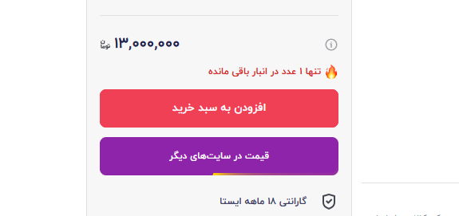
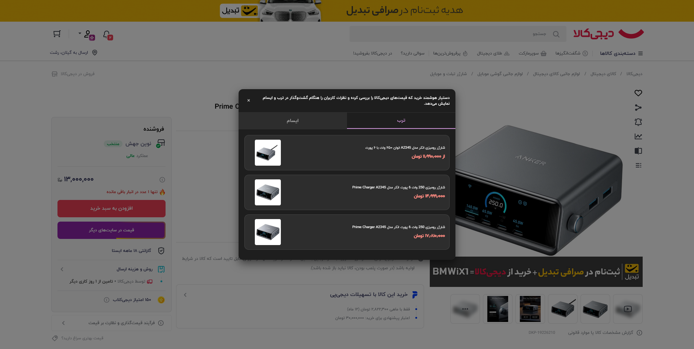
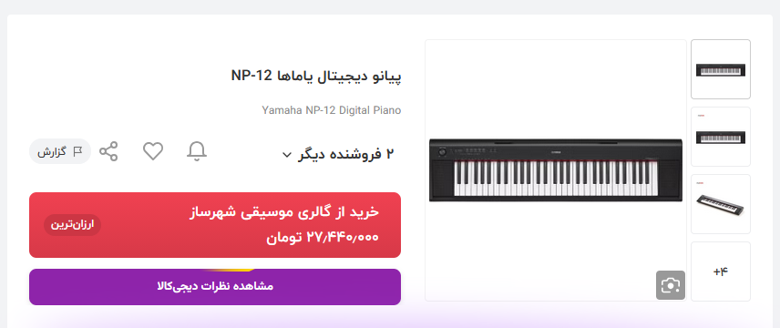
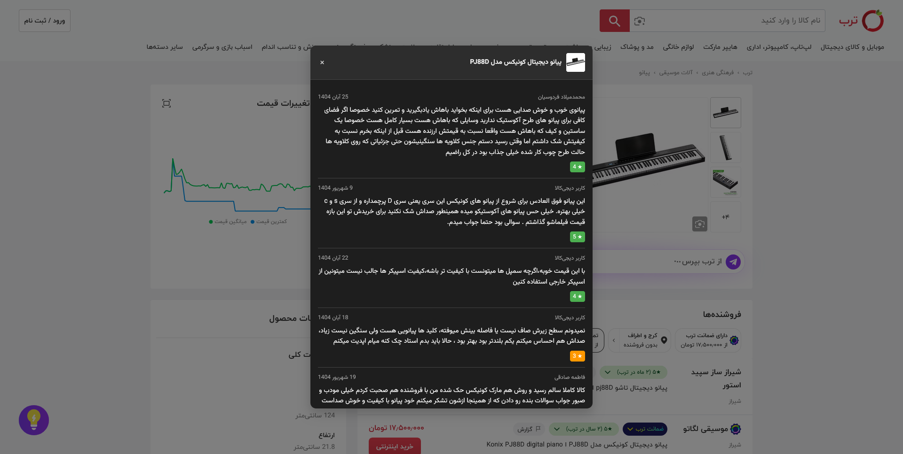
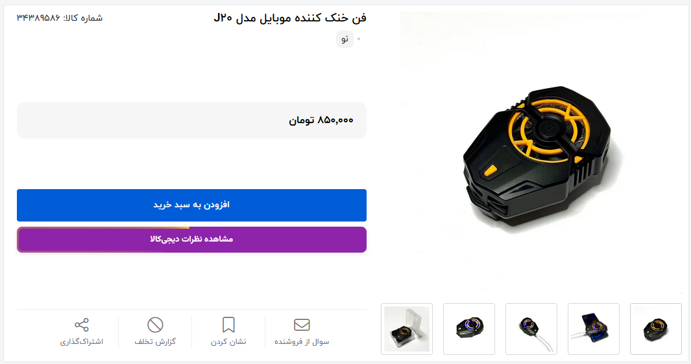
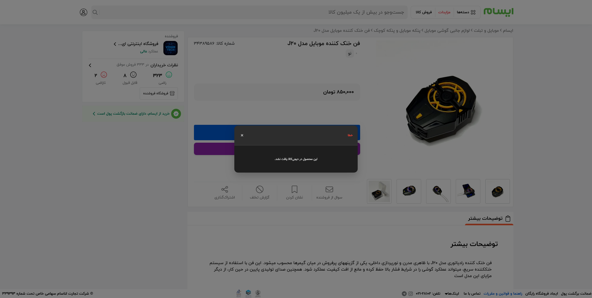
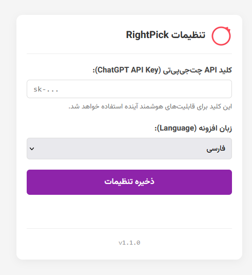

# RightPick

<p align="center">
  
</p>

A smart shopping assistant that checks product prices on Digikala and shows real Digikala user reviews while you browse on Torob and Esam helping you make the best possible choice.

## Screenshots

### Digikala (Price Comparison)
<p align="center">
  
  
</p>

### Torob (Digikala Reviews)
<p align="center">
  
  
</p>

### Esam (Digikala Reviews)
<p align="center">
  
  
</p>

### Options Page
<p align="center">
  
</p>

## Features

- **Price Comparison on Digikala:**
  - Adds a "Check Other Prices" button on Digikala product pages.
  - Automatically searches for the same product on **Torob** and **Esam**.
  - Displays a modal with price results from other stores.
  - Shows a notification (toast) if a cheaper price is found elsewhere.

- **Review Integration on Other Sites:**
  - Automatically detects product pages on **Torob** and **Esam**.
  - Injects a "View Digikala Reviews" button on these external sites.
  - Fetches and displays Digikala user reviews for the corresponding product without leaving the page.

- **Cross-Browser Support:**
  - Supports Chrome (Manifest V3 Service Worker).
  - Supports Firefox (Manifest V3 Background Scripts).

- **Modern UI:**
  - Uses **Vazirmatn** font for better Persian typography.
  - Clean, responsive modal design.
  - Dark mode support.

## Configuration

You can customize the extension settings, including the **Language** (Persian/English) and **AI Features**.

### How to Access Settings:
1.  Right-click on the **RightPick extension icon** in your browser toolbar.
2.  Select **Options** (or **تنظیمات**).

### Available Settings:
-   **ChatGPT API Key:** Enter your OpenAI API Key to enable smart features.
-   **Language:** Switch between Persian (Farsi) and English.
-   **Delete API Key:** Remove your stored API key.

## AI Features (ChatGPT Integration)

RightPick can optionally use **OpenAI's ChatGPT** to significantly improve accuracy.

### capabilities:
1.  **Smart Price Filtering:**
    *   When checking prices on Torob or Esam, the AI analyzes the search results.
    *   It filters out irrelevant items (e.g., accessories, cases, or different models) and keeps only the **exact matches**.
    *   *Result:* You see a clean list of actual prices for your specific product, not a cluttered list of unrelated items.

2.  **Intelligent Product Matching for Reviews:**
    *   When viewing reviews for a product from Torob/Esam, the AI searches Digikala.
    *   It intelligently identifies the correct product ID even if the names are slightly different.
    *   *Result:* You get the **correct reviews** for the exact model you are looking at.

3.  **Smart Retry Strategy:**
    *   If a search yields no results, the AI generates a **simplified search query** (removing extra adjectives, colors, etc.) and tries again.
    *   *Result:* Higher success rate in finding products.

*Note: If no API Key is provided, the extension works in "Standard Mode" using direct text matching and basic search.*

## Installation

### Chrome (Developer Mode)
1. Clone or download this repository to your local machine.
2. Open Google Chrome and navigate to `chrome://extensions`.
3. Toggle on **Developer mode** in the top right corner.
4. Click on the **Load unpacked** button.
5. Select the root directory of this project (the folder containing `manifest.json`).

### Firefox (Developer Mode)
1. Clone or download this repository.
2. Open Firefox and enter `about:debugging#/runtime/this-firefox` in the address bar.
3. Click on **Load Temporary Add-on...**.
4. Browse to the project directory and select the `manifest.json` file.

## Build Instructions

**No build step is required.**

This extension is built with vanilla JavaScript, HTML, and CSS. No bundlers (Webpack, Vite, etc.), transpilers (Babel, TypeScript), or minifiers are used.

To package the extension for submission:
1. Zip the contents of the root directory (including `manifest.json`, `src`, and `_locales`).
2. Submit the `.zip` file directly.

## Project Structure

```
/
├── manifest.json          # Extension configuration (MV3)
├── _locales/              # Localization files (en, fa)
├── src/
│   ├── background/        # Service Worker Logic
│   │   ├── background.js  # Main entry point
│   │   ├── handlers/      # Request handlers (price, review)
│   │   ├── providers/     # API providers (Torob, Esam)
│   │   └── services/      # External services (OpenAI)
│   │
│   ├── content/           # Content Scripts (UI Injection)
│   │   ├── content.js     # Dynamic loader
│   │   ├── content_main.js# Main logic entry
│   │   ├── content.css    # Styles
│   │   ├── modules/       # Shared UI & Logic (Toast, Modal)
│   │   └── providers/     # Site-specific logic (Digikala, External)
│   │
│   ├── options/           # Options Page
│   │   ├── options.html
│   │   ├── options.js
│   │   └── options.css
│   │
│   └── assets/            # Static Assets
│       └── icon/          # Icons
└── README.md
```

## Permissions

- `storage`: To save user language preferences.
- `host_permissions`:
  - `*://*.digikala.com/*`: To inject button and fetch reviews.
  - `*://*.torob.com/p/*`: To inject button on Torob product pages.
  - `*://*.esam.ir/item/*`: To inject button on Esam product pages.
  - `*://api.torob.com/*` & `*://api.esam.ir/*`: To fetch price data.

## License

MIT License
